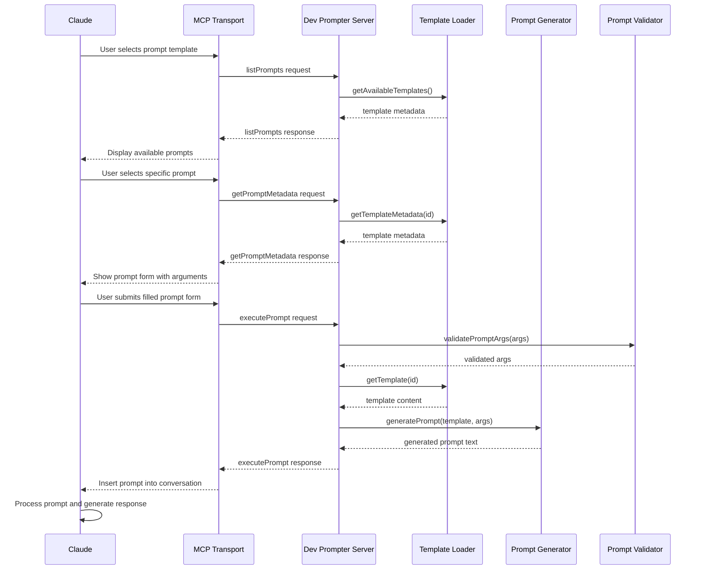

# MCP Dev Prompter

MCP Dev Prompter is a server implementation for the Model Context Protocol (MCP) that provides structured, specialized prompts for development tasks. It allows you to integrate customized prompt templates into Claude conversations to help with software design, coding, and testing.

## Overview

The MCP Dev Prompter server implements the Model Context Protocol using the `@modelcontextprotocol/sdk` package to offer a set of carefully crafted prompts for common development tasks such as:

- High-level system design
- Detailed module design
- Code implementation
- Test suite creation

## How It Works

The following diagram illustrates how the system processes prompt requests:



## Installation

```bash
# Install with npm
npm install @modelcontextprotocol/server-dev-prompter

# Or with pnpm
pnpm add @modelcontextprotocol/server-dev-prompter

# Or with yarn
yarn add @modelcontextprotocol/server-dev-prompter
```

## Setup

1. Create a directory for your prompt templates (if you don't have one already):

```bash
mkdir -p templates
```

2. Create at least one template file (see Templates section below)

3. Start the server with the template directory:

```bash
npx mcp-server-dev-prompter --templateDir ./templates
```

## Using with Claude

Once the server is running, you can use the prompts in your Claude conversations:

1. Start a conversation with Claude
2. Click on "Attach from MCP" in the bottom left corner of the interface
3. Click on "Choose an integration"
4. Under "prompter" you'll see the configured integrations (your loaded templates)
5. Select the prompt template you want to use
6. Fill in any required information
7. Send the prompt to Claude

## Creating Templates

Templates are Markdown files with YAML front matter that define the structure and variables for your prompts. They use Handlebars syntax for variable substitution.

### Template Structure

A template file consists of:

1. Front Matter (required):
   ```yaml
   ---
   description: "What this template does"
   version: "1.0.0"
   arguments:
     variableName:
       description: "What this variable means"
       required: true  # Optional, defaults to template analysis
   ---
   ```

2. Template Content:
   The rest of the file is the template content using Handlebars syntax.
   Variables used in the content must have corresponding argument definitions.

Example template (`high-level-design.md`):

```markdown
---
description: "Generate a high-level design document for a project"
version: "1.0.0"
arguments:
  projectName:
    description: "User-friendly project name"
    required: true
  projectsParentFolder:
    description: "Parent folder for all projects"
    required: true
  projectFolder:
    description: "Subfolder of projectsParent folder containing all project files "
    required: true
---

We are working on the {{projectName}} design and implementation.
The project is in a folder called {{projectsParentFolder}}/{{projectFolder}}

1. PURPOSE

- STATE the core function of the system
- LIST all supported environments
- EXPLAIN key constraints

2. CORE REQUIREMENTS
   ORGANIZE into these MANDATORY categories:

- STORAGE requirements
- ENVIRONMENT support
- PERFORMANCE needs
- OPERATIONAL needs
- POLICY/COMPLIANCE rules

For each requirement:

- START with "MUST" or "SHOULD"
- MAKE it measurable/testable
- CITE any source or justification

# ... rest of the template ...
```

### Variable Usage

You can use variables in two ways:

1. Direct usage (required by default): `{{variableName}}`
2. Conditional usage (optional by default): `{{#if variableName}}...{{/if}}`

## Available Templates

The project comes with several built-in templates:

1. `high-level-design.md` - Generates a comprehensive high-level design document
2. `detailed-design.md` - Creates detailed module specifications
3. `generate-code.md` - Produces implementation code based on specifications

## Custom Templates

You can create your own custom templates by following these steps:

1. Create a new markdown file in your templates directory
2. Add the required YAML front matter with description, version, and arguments
3. Write your template content using Handlebars syntax
4. Restart the MCP Dev Prompter server

## Command-Line Options

```bash
npx mcp-server-dev-prompter [options]
```

Options:
- `--templateDir <path>` - Path to directory containing template files (required)
- `--debug` - Enable debug logging
- `--watch` - Watch template directory for changes (restart not required)
- `--logDir <path>` - Directory for log files (default: ~/Library/Logs/Claude/)
- `--inspectorPort <port>` - Port for MCP inspector (default: 3000)

## Log Management

This project includes scripts for managing Claude log files:

- `npm run logs` - Tails and follows the last 20 lines of Claude log files
- `npm run logs:clean` - Deletes all Claude log files

## Development

```bash
# Install dependencies
pnpm install

# Build with source maps for debugging
pnpm run build:debug

# Run tests
pnpm test

# Start the server
pnpm start
```

## License

This project is licensed under the MIT License - see the [LICENSE](LICENSE) file for details.
